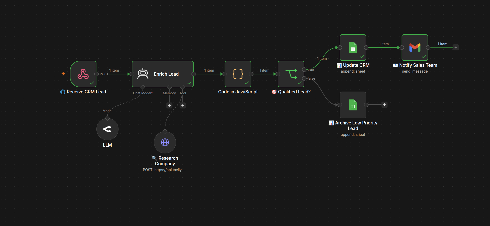

<p align="center">


</p>

# 🤝 AI CRM Lead Enrichment & Qualification

An AI-powered CRM lead enrichment and qualification workflow built with **n8n**, **OpenRouter GPT-5 Mini**, **Tavily Search**, **Google Sheets**, and **Gmail**. The workflow automatically researches incoming companies, enriches lead information, qualifies business opportunities, stores leads in a CRM, and notifies the sales team.

---

## 🎯 Business Problem

Sales teams receive numerous inbound leads every day, but the submitted information is often incomplete. Sales representatives spend valuable time researching companies, identifying industries, estimating company size, and deciding whether a lead deserves immediate attention.

This workflow automates the qualification process by researching each company, enriching the lead profile, calculating a qualification score, routing qualified leads into the CRM, and archiving lower-priority opportunities.

---

## 📷 Workflow Preview



---

## 📈 Business Impact

- 🤖 Automates company research
- 🏢 Enriches lead information using AI
- 🎯 Scores incoming leads automatically
- 📊 Separates qualified and low-priority leads
- 📧 Instantly notifies the sales team
- ⏱️ Reduces manual qualification time
- 🚀 Improves sales productivity

---

## ✨ Features

- 🌐 Webhook-based lead intake
- 🔍 AI-powered company research using Tavily
- 🤖 Intelligent lead enrichment
- 📊 Automatic lead qualification scoring
- 🎯 Business rule-based routing
- 📁 CRM storage using Google Sheets
- 📦 Low-priority lead archiving
- 📧 Automated sales notifications
- ⚡ Fully automated end-to-end workflow

---

## 🛠 Tech Stack

- n8n
- Tavily Search API
- Google Sheets API
- Gmail API
- HTTP Request Tool
- AI Agent

---

## 🏗 Workflow Architecture

```text
Receive CRM Lead
        │
        ▼
Research Company
        │
        ▼
AI Lead Enrichment
        │
        ▼
Lead Qualification
        │
        ▼
Qualified?
      /       \
     /         \
    ▼           ▼
Update CRM   Archive Lead
    │
    ▼
Notify Sales Team
```

---

## 📂 Project Structure

```text
.
├── workflow
│   └── AI CRM Lead Enrichment & Qualification.json
│
├── screenshots
│   └── ai-crm-lead-enrichment-qualification.png
│
└── README.md
```

---

## ⚙️ Installation

1. Import the workflow JSON into n8n.
2. Configure your OpenRouter credentials.
3. Configure your Tavily API credentials.
4. Configure your Google Sheets credentials.
5. Configure your Gmail credentials.
6. Activate the workflow.

---

## 🔄 Workflow Overview

### 🌐 Lead Intake

1. Receive a new CRM lead through a webhook.
2. Validate the submitted lead information.

### 🔍 Company Research

3. Research the company using Tavily Search.
4. Gather business information and public company data.

### 🤖 AI Enrichment

5. Identify the company's industry.
6. Estimate company size.
7. Analyze the lead's business needs.
8. Calculate a lead qualification score.
9. Generate a concise business summary.

### 🎯 Qualification

10. Evaluate whether the lead is qualified.
11. Route qualified and low-priority leads accordingly.

### 📊 CRM Management

12. Store qualified leads in Google Sheets.
13. Archive low-priority leads separately.

### 📧 Sales Notification

14. Send a detailed email to the sales team containing the enriched lead profile and qualification results.

---

## 💼 Use Cases

- CRM Automation
- Lead Qualification
- Lead Enrichment
- Sales Automation
- AI Sales Operations
- B2B Lead Scoring
- Customer Acquisition Automation

---

## 👨‍💻 Author

**Mahmoud**

Faculty of Artificial Intelligence

AI Automation & Intelligent Workflow Developer

GitHub:
https://github.com/barbarussa512
